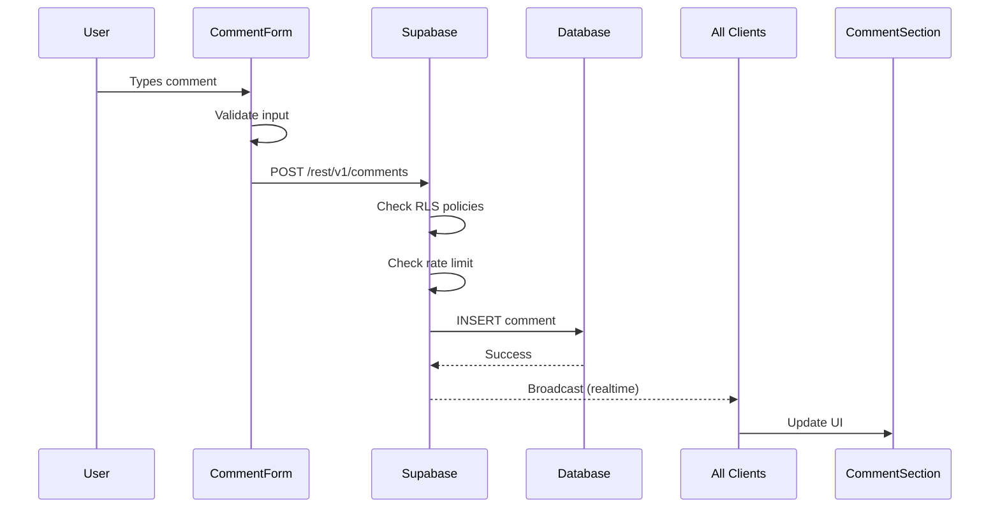
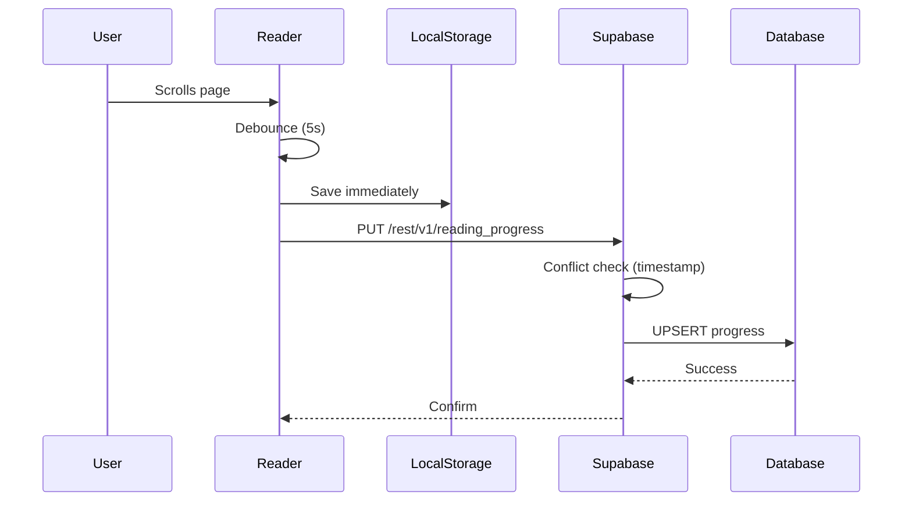

# System Architecture

**Project**: Stranger Things - The Right Side Up  
**Type**: Fan-Fiction Novel Reader with Optional Backend Features  
**Last Updated**: Phase 1 - Initial Setup

---

## 🎯 Architecture Overview

This project follows a **JAMstack architecture** with optional backend enhancements:

```
┌─────────────────────────────────────────────────────────────┐
│                        CLIENT SIDE                          │
│  ┌──────────────────────────────────────────────────────┐  │
│  │  React + TypeScript + Vite + Tailwind CSS            │  │
│  │  - Static content rendering                          │  │
│  │  - Client-side routing (React Router)                │  │
│  │  - LocalStorage fallbacks                            │  │
│  └──────────────────────────────────────────────────────┘  │
└─────────────────────────────────────────────────────────────┘
                            ↕
┌─────────────────────────────────────────────────────────────┐
│                    BACKEND SERVICES                         │
│  ┌──────────────┐  ┌──────────────┐  ┌──────────────┐     │
│  │  Supabase    │  │   Vercel     │  │   Resend     │     │
│  │  (Database   │  │  (Serverless │  │   (Email)    │     │
│  │   + Auth)    │  │  Functions)  │  │              │     │
│  └──────────────┘  └──────────────┘  └──────────────┘     │
└─────────────────────────────────────────────────────────────┘
```

---

## 🏗️ Core Architecture Principles

### 1. **Progressive Enhancement**
- Core reading experience works without backend
- Backend features enhance UX but aren't required
- Graceful degradation when services are unavailable

### 2. **Modular & Optional**
- Each feature can be enabled/disabled independently
- Feature flags control backend integration
- No breaking changes to existing functionality

### 3. **Security First**
- Row Level Security (RLS) on all database tables
- API keys never exposed to client
- Rate limiting on all public endpoints
- Input validation and sanitization

### 4. **Performance Optimized**
- Client-side rendering for instant navigation
- Optimistic UI updates
- Database indexes on frequently queried fields
- Serverless functions for scalability

---

## 📦 Technology Stack

### Frontend
| Technology | Purpose | Why? |
|------------|---------|------|
| **React 19** | UI Framework | Modern, declarative, great DX |
| **TypeScript** | Type Safety | Catch errors early, better IDE support |
| **Vite** | Build Tool | Fast HMR, modern bundler |
| **Tailwind CSS** | Styling | Utility-first, rapid development |
| **React Router 7** | Routing | Client-side navigation |
| **Lucide React** | Icons | Lightweight, consistent icons |

### Backend
| Technology | Purpose | Why? |
|------------|---------|------|
| **Supabase** | Database + Auth | Postgres with RLS, built-in auth |
| **Vercel** | Serverless Functions | Easy deployment, OG image generation |
| **Resend** | Email Delivery | Modern API, great DX, reliable |

---

## 🗄️ Database Architecture (Supabase)

### Tables Overview

```sql
profiles
├── id (uuid, FK to auth.users)
├── display_name (text)
├── avatar_url (text)
├── is_admin (boolean)
└── created_at (timestamp)

comments
├── id (uuid)
├── chapter_id (text)
├── user_id (uuid, FK to profiles)
├── content (text)
├── is_anonymous (boolean)
├── is_flagged (boolean)
├── created_at (timestamp)
└── updated_at (timestamp)

reading_progress
├── id (uuid)
├── user_id (uuid, FK to profiles)
├── chapter_id (text)
├── scroll_percentage (float)
└── updated_at (timestamp)

newsletter_subscribers
├── id (uuid)
├── email (text, unique)
├── confirmed (boolean)
├── confirmation_token (text)
├── unsubscribe_token (text)
├── subscribed_at (timestamp)
└── confirmed_at (timestamp)

comment_flags
├── id (uuid)
├── comment_id (uuid, FK to comments)
├── flagged_by_user_id (uuid, FK to profiles)
├── reason (text)
└── created_at (timestamp)
```

### Row Level Security (RLS)

All tables have RLS enabled with these policies:
- **SELECT**: Public read access (except sensitive fields)
- **INSERT**: Authenticated users only (except newsletter)
- **UPDATE**: Own records only (admins can update all)
- **DELETE**: Own records only (admins can delete all)

---

## 🔐 Authentication Flow

### Anonymous Users
```
1. User visits site
2. Can read content immediately
3. Can post comments as "Anonymous"
4. LocalStorage for reading progress
5. No sync across devices
```

### Authenticated Users (Google OAuth)
```
1. User clicks "Sign in with Google"
2. Redirects to Google OAuth consent
3. Returns with access token
4. Supabase creates/updates profile
5. Can post comments with display name
6. Reading progress syncs across devices
7. Access to admin dashboard (if is_admin=true)
```

---

## 🎨 Feature Architecture

### 1. Comment System

**Flow:**
```
User writes comment → Validate input → Check rate limit
→ Save to Supabase → Real-time broadcast → UI update
```

**Components:**
- `CommentSection`: Container, fetches comments
- `CommentForm`: Input validation, submission
- `CommentItem`: Individual comment display
- Real-time subscription for live updates

**Moderation:**
- Users can flag inappropriate comments
- Admins see flagged comments dashboard
- Admins can delete comments
- Moderation actions logged

---

### 2. Reading Progress Sync

**Flow:**
```
User scrolls → Debounced save (every 5s)
→ Check if authenticated → Save to Supabase
→ Conflict resolution (latest timestamp)
```

**Fallback Strategy:**
```
Authenticated: Supabase (primary) → LocalStorage (backup)
Anonymous: LocalStorage only
```

**Sync on Login:**
```
1. User logs in
2. Fetch Supabase progress
3. Compare with LocalStorage
4. Use latest timestamp
5. Sync to Supabase
```

---

### 3. Dynamic OpenGraph Images

**Architecture:**
```
Social media crawler → /api/og/[chapterId]
→ Vercel Serverless Function
→ Generate image with @vercel/og
→ Return PNG with cache headers
```

**Optimization:**
- Cache for 24 hours (s-maxage=86400)
- Generate on-demand (not pre-built)
- Fallback to static image if error

---

### 4. Newsletter System

**Double Opt-In Flow:**
```
1. User enters email
2. Validate + check duplicates
3. Generate confirmation token
4. Send confirmation email (Resend)
5. User clicks confirmation link
6. Mark as confirmed in database
7. Show success message
```

**Unsubscribe Flow:**
```
1. User clicks unsubscribe link (with token)
2. Validate token
3. Delete from database
4. Show confirmation message
```

---

## 🚀 Deployment Architecture

### Vercel Deployment

```
┌─────────────────────────────────────────┐
│  Vercel Edge Network (CDN)              │
│  ├── Static Assets (HTML, CSS, JS)      │
│  ├── React App Bundle                   │
│  └── Serverless Functions               │
│      ├── /api/og/[chapterId].ts         │
│      ├── /api/newsletter/subscribe.ts   │
│      ├── /api/newsletter/confirm.ts     │
│      └── /api/newsletter/unsubscribe.ts │
└─────────────────────────────────────────┘
           ↓                    ↓
    ┌──────────────┐      ┌──────────┐
    │  Supabase    │      │  Resend  │
    │  Database    │      │  Email   │
    └──────────────┘      └──────────┘
```

### Environment Variables (Vercel)
- Stored in Vercel dashboard
- Separate for Preview/Production
- `VITE_*` variables exposed to client
- Others kept server-side only

---

## 🔄 Data Flow Examples

### Example 1: User Posts Comment



### Example 2: Reading Progress Sync



---

## 🛡️ Security Considerations

### Input Validation
- All user input sanitized
- XSS prevention (React handles by default)
- SQL injection prevention (Supabase parameterized queries)
- Email validation (regex + DNS check)

### Rate Limiting
- Comments: 10 per hour per user
- Newsletter: 5 subscriptions per day per IP
- Implemented at API route level
- Stored in Supabase (simple table)

### Content Moderation
- User flagging system
- Admin dashboard for review
- Soft delete (keep records for audit)
- Spam detection (basic keyword filtering)

---

## 📊 Performance Metrics

### Target Metrics
- **First Contentful Paint**: < 1s
- **Time to Interactive**: < 2s
- **Lighthouse Score**: > 95
- **Database Query Time**: < 100ms
- **API Response Time**: < 200ms

### Optimization Strategies
- Code splitting (React.lazy)
- Image optimization
- Database indexes
- CDN caching
- Debounced saves

---

## 🔧 Feature Flags

All backend features controlled via environment variables:

```typescript
const FEATURES = {
  comments: import.meta.env.VITE_ENABLE_COMMENTS === 'true',
  progressSync: import.meta.env.VITE_ENABLE_PROGRESS_SYNC === 'true',
  newsletter: import.meta.env.VITE_ENABLE_NEWSLETTER === 'true',
};
```

**Graceful Degradation:**
- If feature disabled: Component doesn't render
- If Supabase down: Fallback to localStorage
- If error: Show user-friendly message

---

## 📈 Scalability Considerations

### Current Scale (Expected)
- **Users**: 10-1000 concurrent
- **Comments**: ~10,000 total
- **Newsletter**: ~5,000 subscribers

### Scaling Strategy
- Supabase handles up to 500 concurrent connections (free tier)
- Vercel serverless auto-scales
- Database indexes prevent slow queries
- Real-time subscriptions limited to active readers

### Future Enhancements (if needed)
- Redis for rate limiting (currently Supabase)
- Comment pagination (currently load all per chapter)
- CDN for OG images (currently on-demand)

---

## 🐛 Error Handling Strategy

### Client-Side
```typescript
try {
  await supabase.from('comments').insert(data);
} catch (error) {
  // 1. Log to console (dev mode)
  // 2. Show toast notification
  // 3. Fallback to localStorage if applicable
  // 4. Don't crash the app
}
```

### Server-Side (API Routes)
```typescript
try {
  // Process request
} catch (error) {
  return new Response(
    JSON.stringify({ error: 'User-friendly message' }),
    { status: 500 }
  );
}
```

---

## 📝 Documentation Structure

```
/app/docs/
├── ARCHITECTURE.md (this file)
├── ENVIRONMENT_SETUP.md
├── API_REFERENCE.md
├── DATABASE_SCHEMA.md
├── AUTH_SETUP.md
├── COMMENTS_GUIDE.md
├── PROGRESS_SYNC_GUIDE.md
├── OG_IMAGES_GUIDE.md
├── NEWSLETTER_GUIDE.md
├── DEPLOYMENT.md
├── TROUBLESHOOTING.md
└── TESTING_REPORT.md
```

---

## 🎓 Learning Resources

- [Supabase Documentation](https://supabase.com/docs)
- [Vercel Functions](https://vercel.com/docs/functions)
- [Resend Docs](https://resend.com/docs)
- [React Router](https://reactrouter.com/)

---

**Next Steps:** Proceed to Phase 2 - Database Schema Implementation
